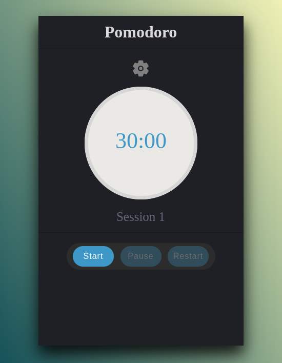
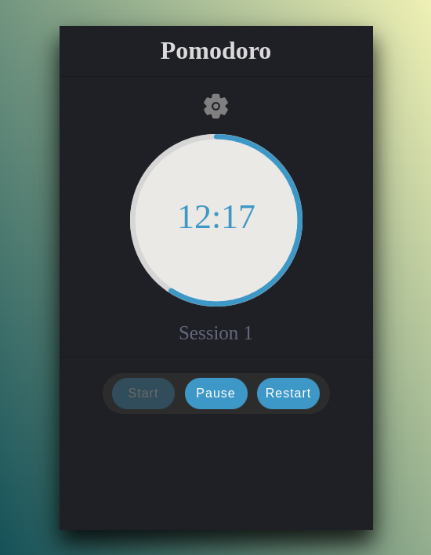
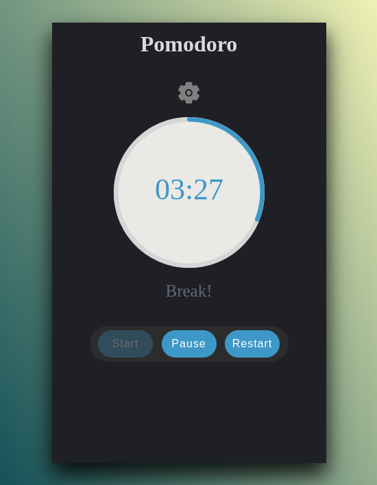
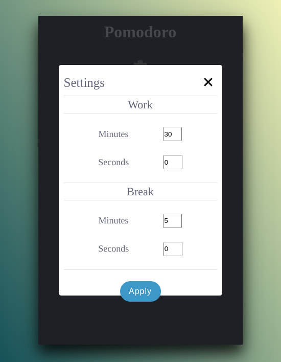

# Pomodoro App

This project is a pomodoro application, widely used during studies or moments of work.

## Overview

This project was built with React and Context API

### Demo
- [Live project](https://viniciuslacerda-pomodoro.vercel.app/)

### Screenshots

  
  
  
  

### Local usage
- Clone this repository;
- Access the local repository folder;
- run $ npm install;
- run $ npm start.
